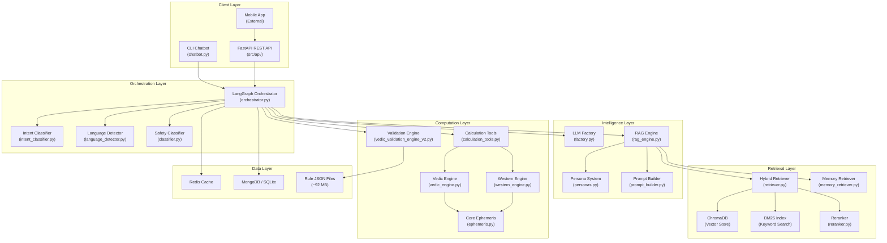
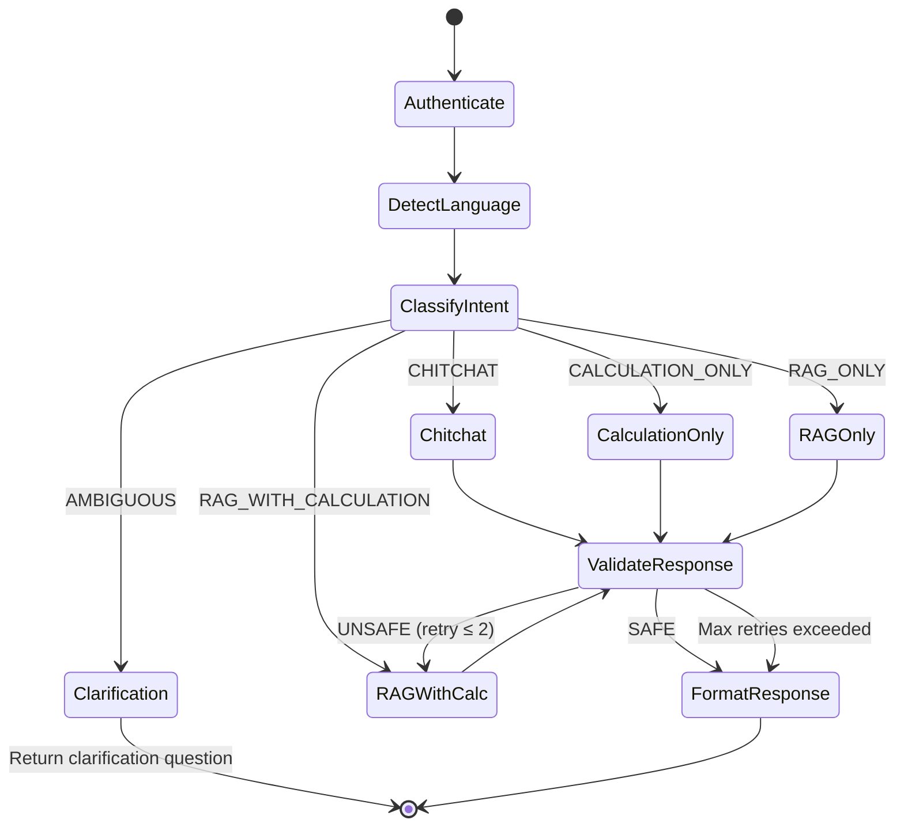
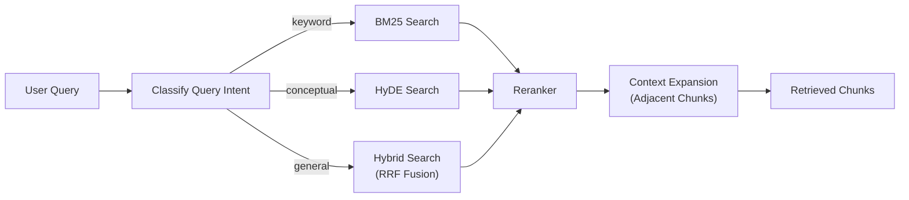
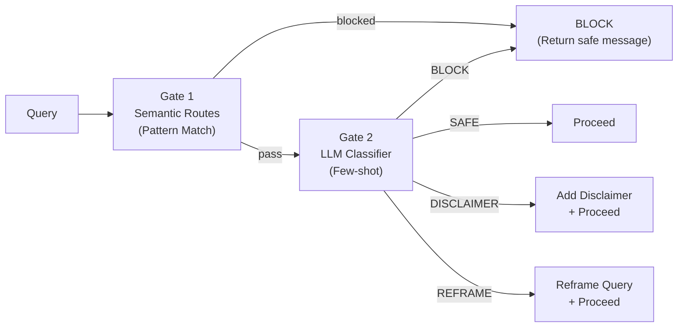
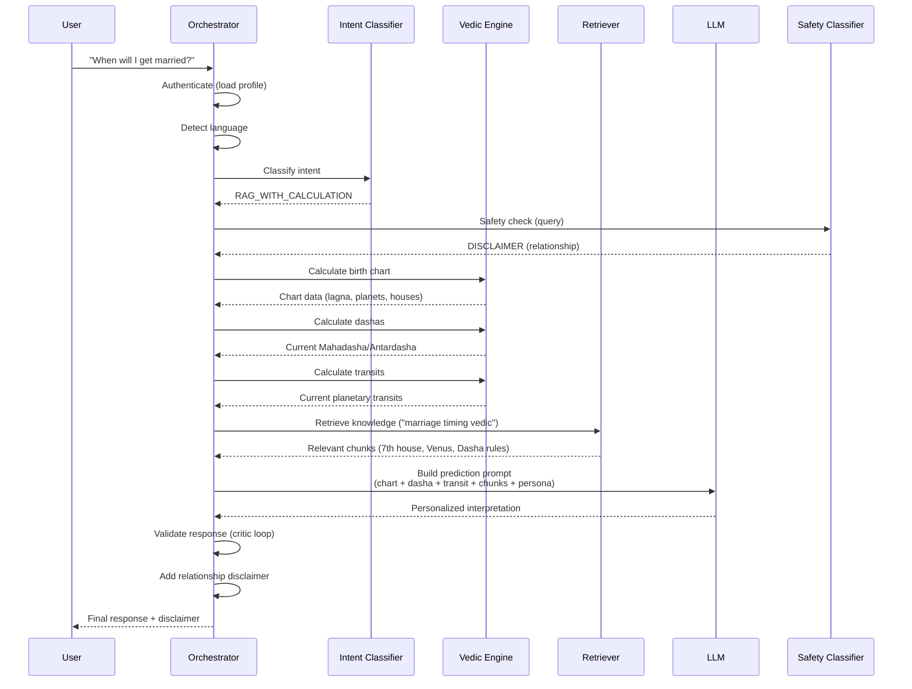
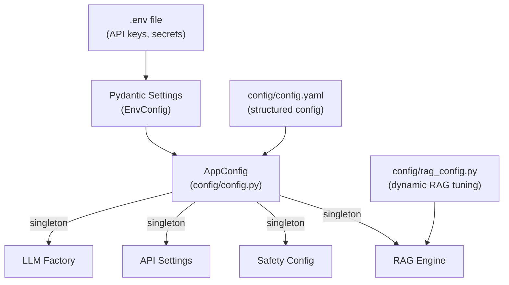
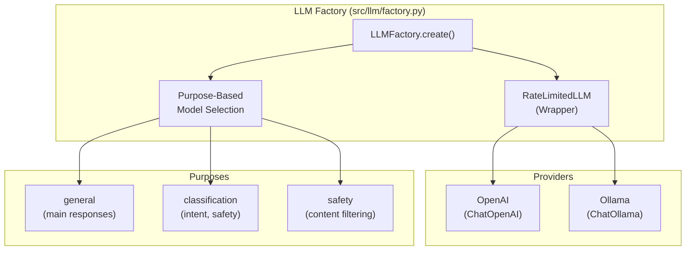
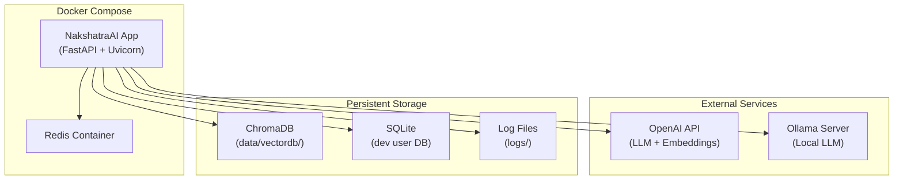

# NakshatraAI — System Architecture

> **Last Updated:** 2026-02-17  
> **Version:** 2.0 (Post-MVP Architecture)

---

## 1. High-Level Architecture

NakshatraAI follows a **layered architecture** with clear separation between deterministic computation, knowledge retrieval, LLM interpretation, and safety enforcement.



---

## 2. Request Processing Flow

Every user query flows through a deterministic LangGraph state machine:



### Node Descriptions

| Node | Responsibility | Key Logic |
|---|---|---|
| **Authenticate** | Load user profile + session data | MongoDB/dummy DB lookup, merge session |
| **DetectLanguage** | Identify query language | Library-based → LLM fallback |
| **ClassifyIntent** | Route query to correct handler | LLM classification → pattern fallback |
| **Chitchat** | Quick conversational response | Persona-driven, no computation |
| **Clarification** | Ask user to disambiguate | Detects "Mars in 7th" ambiguity |
| **CalculationOnly** | Raw chart data (no interpretation) | VedicEngine direct output |
| **RAGWithCalculation** | Personalized prediction | Chart + Dasha + Transit + RAG + LLM |
| **RAGOnly** | General astrology theory | RAG retrieval + LLM synthesis |
| **ValidateResponse** | Critic loop (safety check) | Constitution verification, max 2 retries |
| **FormatResponse** | Add disclaimers, format output | Language-appropriate formatting |

---

## 3. Module Architecture

### 3.1 Computation Layer

The bottom-most layer. **Purely deterministic** — no LLM calls, no network dependencies.

```
src/engines/
├── core/                          # Shared astronomical primitives
│   ├── ephemeris.py               # Swiss Ephemeris wrapper (pyswisseph)
│   ├── datetime_utils.py          # Julian Day ↔ datetime conversions
│   ├── coordinates.py             # GeoPosition, lat/lon handling
│   ├── celestial_bodies.py        # CelestialBody enum, planet data
│   └── exceptions.py              # Custom exception hierarchy
│
├── vedic/                         # Vedic (Sidereal) astrology
│   ├── vedic_engine.py            # Main engine: chart, lagna, positions
│   ├── rashi_nakshatra.py         # Rashi + Nakshatra calculations
│   ├── dasha_systems.py           # Vimshottari dasha periods
│   ├── aspects_yogas.py           # Aspects + yoga detection
│   ├── divisional_charts.py       # Navamsa, other D-charts
│   ├── graha_stats.py             # Shadbala (planetary strength)
│   └── vedic_constants.py         # Ayanamsa, zodiac, nakshatra data
│
└── western/                       # Western (Tropical) astrology
    ├── western_engine.py          # Main engine: tropical chart
    ├── western_aspects.py         # Aspect patterns
    ├── western_dignities.py       # Essential/accidental dignities
    ├── western_houses.py          # House systems
    └── western_signs.py           # Sign characteristics
```

**Design Principle:** The `core/` module has ZERO dependencies on other project modules. Vedic and Western engines depend only on `core/`.

### 3.2 RAG Pipeline

```
src/rag/
├── rag_engine.py           # Main RAG orchestrator (876 lines)
├── retriever.py            # Multi-strategy retriever (Semantic/BM25/Hybrid/HyDE)
├── reranker.py             # Cross-encoder reranking
├── memory_retriever.py     # Long-term conversation memory
├── ingest_local.py         # Local file ingestion utility
│
├── extraction/             # PDF → structured text
│   ├── vision_pipeline.py  # Vision LLM extraction pipeline
│   ├── vision_extractor.py # Gemini Vision API integration
│   ├── extraction_schemas.py # Extraction output schemas
│   └── extraction_prompts.py # Extraction prompt templates
│
└── preprocessing/          # Text → embeddings (6-phase)
    ├── pipeline.py         # Master preprocessing pipeline
    ├── structural_cleaner.py  # Phase 1: Clean raw text
    ├── page_analyzer.py       # Phase 2: Cross-page analysis
    ├── semantic_segmenter.py  # Phase 3: Semantic chunking
    ├── chunk_enricher.py      # Phase 4: LLM metadata enrichment
    ├── subchunker.py          # Phase 5: Sub-chunk splitting
    ├── embedder.py            # Phase 6: Embedding generation
    ├── vector_db_builder.py   # ChromaDB ingestion
    ├── schemas.py             # Pipeline data schemas
    └── book_profiler.py       # Source-specific processing config
```

**Retrieval Strategy Routing:**



### 3.3 AI / Intelligence Layer

```
src/ai/
├── intent_classifier.py    # 4-category LLM classifier with fallback
├── hybrid_retriever.py     # LangChain-compatible retriever wrapper
├── prompt_builder.py       # Dynamic prompt construction
├── persona_generator.py    # LLM-based persona generation
├── personas.py             # Pre-defined astrologer personas
└── user_manager.py         # User profile & birth data management
```

### 3.4 Safety Layer

```
src/safety/
├── classifier.py           # Multi-gate LLM safety classifier
├── input_validator.py      # Pattern-based pre-screening (Gate 1)
├── constitution.py         # Astrologer behavioral rules
├── disclaimers.py          # Domain-specific disclaimer templates
├── models.py               # SafetyDecision, BlockReasons enums
└── templates.py            # Safety prompt templates
```

**Safety Processing Pipeline:**



### 3.5 API Layer

```
src/api/
├── main.py                 # FastAPI app setup, middleware, events
├── config.py               # API-specific settings (Pydantic)
├── dependencies.py         # Singleton DI (orchestrator, engines, etc.)
│
├── routes/
│   ├── chat.py             # POST /api/v1/chat
│   ├── user.py             # User management endpoints
│   ├── calculation.py      # Direct calculation endpoints
│   └── health.py           # Health check / readiness
│
├── middleware/
│   └── (timing, CORS)
│
└── schemas/
    └── user.py             # Request/response Pydantic models
```

### 3.6 Services Layer

```
src/services/
├── astrology_service.py      # 3rd-party API orchestration + caching
├── backend_data_adapter.py   # Mobile app ↔ NakshatraAI translation
└── cache_manager.py          # Redis cache with TTL management
```

---

## 4. Data Flow: Personalized Prediction

The most complex flow — `RAG_WITH_CALCULATION`:



---

## 5. Configuration Architecture



**Precedence:** `.env` overrides → `config.yaml` defaults → code defaults

---

## 6. LLM Provider Architecture



---

## 7. Dependency Graph

```
Orchestrator
├── IntentClassifier (src/ai/)
├── UserManager (src/ai/)
├── HybridRetriever (src/ai/)
├── PromptBuilder (src/ai/)
├── CalculationTools (src/tools/)
│   └── VedicEngine (src/engines/vedic/)
│       └── CoreEphemeris (src/engines/core/)
├── SafetyClassifier (src/safety/)
├── LLMFactory (src/llm/)
├── RAGEngine (src/rag/)
│   ├── AstrologyRetriever (src/rag/)
│   │   └── ChromaDB + BM25
│   ├── MemoryRetriever (src/rag/)
│   └── Reranker (src/rag/)
├── LanguageDetector (src/locales/)
├── ValidationEngine (src/prediction/) [optional]
└── ConversationStore (scripts/)
```

---

## 8. Deployment Architecture



---

## 9. Key Design Decisions

| Decision | Rationale |
|---|---|
| **Deterministic calculations over LLM** | Astronomical positions must be exact. LLMs hallucinate numbers. |
| **RAG over fine-tuning for knowledge** | Classical texts need factual accuracy. RAG provides citations. |
| **LangGraph over simple chains** | Complex 4-way routing with state needs graph-based orchestration. |
| **Multi-gate safety** | Pattern matching (fast) + LLM classification (accurate) = robust. |
| **Purpose-based LLM selection** | Classification needs speed; predictions need quality. |
| **Stateless API mode** | Mobile app pre-computes charts; chatbot interprets. Scales better. |
| **Hybrid retrieval (RRF)** | Combines semantic (meaning) + keyword (exact terms) strengths. |
| **Constitution-based critic loop** | Post-generation verification catches hallucinations and unsafe content. |

---

## 10. File Map (Complete)

```
astro_chatbot/
├── chatbot.py                      # CLI entry point
├── config/
│   ├── config.py                   # Main config loader (Pydantic + YAML)
│   ├── config.yaml                 # Base configuration
│   ├── rag_config.py               # Dynamic RAG settings
│   └── logger.py                   # Logging configuration
│
├── src/
│   ├── orchestration/
│   │   └── orchestrator.py         # LangGraph orchestrator (1,693 lines)
│   │
│   ├── ai/
│   │   ├── intent_classifier.py    # 4-category classifier
│   │   ├── hybrid_retriever.py     # LangChain retriever wrapper
│   │   ├── prompt_builder.py       # Prompt construction
│   │   ├── persona_generator.py    # Dynamic persona creation
│   │   ├── personas.py             # Pre-built personas
│   │   └── user_manager.py         # User profile management
│   │
│   ├── engines/
│   │   ├── core/                   # Swiss Ephemeris wrapper (5 files)
│   │   ├── vedic/                  # Vedic astrology engine (8 files)
│   │   └── western/                # Western astrology engine (7 files)
│   │
│   ├── rag/
│   │   ├── rag_engine.py           # Main RAG orchestrator
│   │   ├── retriever.py            # Multi-strategy retriever
│   │   ├── reranker.py             # Cross-encoder reranking
│   │   ├── memory_retriever.py     # Conversation memory
│   │   ├── extraction/             # PDF extraction (6 files)
│   │   └── preprocessing/          # Text preprocessing (11 files)
│   │
│   ├── llm/
│   │   ├── factory.py              # LLM provider factory
│   │   └── prompts/                # Prompt templates
│   │
│   ├── safety/                     # Safety & guardrails (7 files)
│   ├── api/                        # FastAPI REST API (routes, schemas)
│   ├── services/                   # Data services & caching
│   ├── tools/                      # Calculation tool wrappers
│   ├── routing/                    # Semantic router
│   ├── locales/                    # i18n (6 languages)
│   ├── prediction/                 # Validation engine
│   ├── db/                         # Database clients
│   ├── integrations/               # 3rd-party API clients
│   └── utils/                      # Cost tracking, formatting, etc.
│
├── scripts/                        # Utility scripts (6 files)
├── tests/                          # Test suite (20 files)
├── data/                           # Data directory (vectordb, profiles)
├── docs/                           # Documentation
├── Dockerfile                      # Container definition
├── docker-compose.yml              # Multi-container setup
└── requirements.txt                # Python dependencies
```